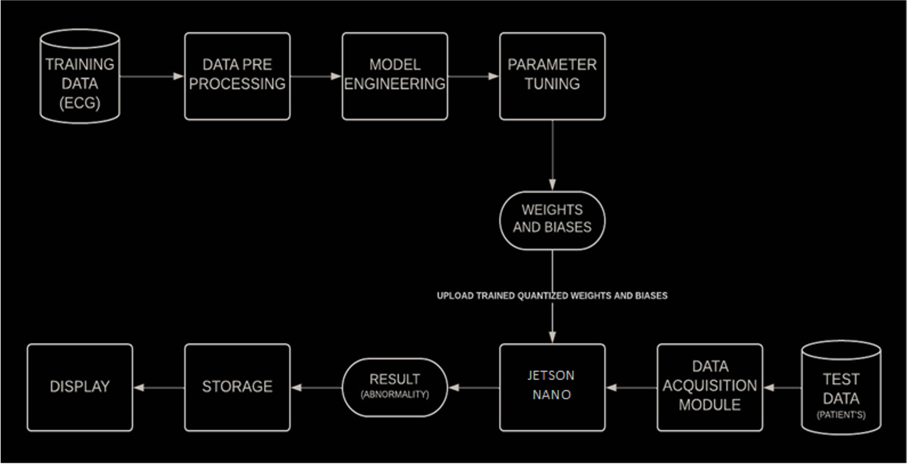
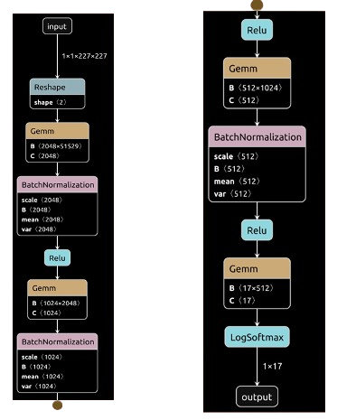

# CUDA Accelerated Deep FNN based Approach for Multi-Class ECG Classification in Arrhythmia Detection

## Project Overview

This project addresses the critical need for efficient and accurate arrhythmia detection by leveraging deep learning techniques. With the increasing prevalence of heart-related conditions, our goal is to develop a portable, real-time ECG classification system for effective and timely diagnosis.

## Technological Approach

A Deep Feedforward Neural Network (D-FNN) is employed here for arrhythmia classification. The DFNN provides a robust framework for real-time inference and efficient performance on hardware accelerators like the NVIDIA Jetson Nano with CUDA. This approach ensures low-latency and energy-efficient operation, making it suitable for portable and real-time applications.

## Dataset

We used the MIT-BIH Arrhythmia Dataset from the PhysioNet database, which includes data from 45 subjects stratified into 17 classes, including 15 heart disorders, pacemaker rhythm, and normal sinus rhythm.

## Methodology



## Existing Models

- **1D CNN**: Highlighted performance improvement with higher dimensionality.
- **AlexNet**: Comparable computational complexity to D-FNN.

## Proposed Model Architecture (D-FNN)



## Performance Comparison Table

| Model   | Accuracy | Precision | Recall | F1-Score |
|---------|----------|-----------|--------|----------|
| ALEXNET | 0.9417   | 0.9443    | 0.9440 | 0.9480   |
| DFNN    | 0.9530   | 0.9538    | 0.9530 | 0.9525   |
| 1D CNN  | 0.9500   | 0.9522    | 0.9500 | 0.9574   |

## Power and Time Comparison Table

| Hardware Configuration                                | Inference Time (ms) | Power Utilization (W) |
|-------------------------------------------------------|---------------------|-----------------------|
| NVIDIA RTX 4070 (Ada Lovelace) + AMD THREADRIPPER 5955 WX (CPU) | 862.111             | 14                    |
| NVIDIA RTX 4070 (Ada Lovelace) + AMD THREADRIPPER 5955 WX (GPU) | 2.409               | 27                    |
| NVIDIA JETSON NANO 2 GB (Maxwell) + QUAD CORE ARM A57 (CPU) | 15024.332           | 0.901                 |
| NVIDIA JETSON NANO 2 GB (Maxwell) + QUAD CORE ARM A57 (GPU) | 191.325             | 0.139                 |
| NVIDIA GTX 1650 MOBILE (Turing) + AMD RYZEN 5 5600H (CPU) | 2120.686            | 6.55                  |
| NVIDIA GTX 1650 MOBILE (Turing) + AMD RYZEN 5 5600H (GPU) | 4.69                | 14                    |

## Setup Instructions

### Prerequisites

- CUDA Toolkit
- NVIDIA GPU (e.g., NVIDIA Jetson Nano, RTX 4070, GTX 1650)
- Python 3.3 or later
- NumPy

### Environment Variables

Before running the Makefile, set the following environment variables to match your local setup:

```sh
export PYTHON_INCLUDE=/path/to/python/include
export PYTHON_LIB=/path/to/python/lib
export NUMPY_INCLUDE=/path/to/numpy/include
